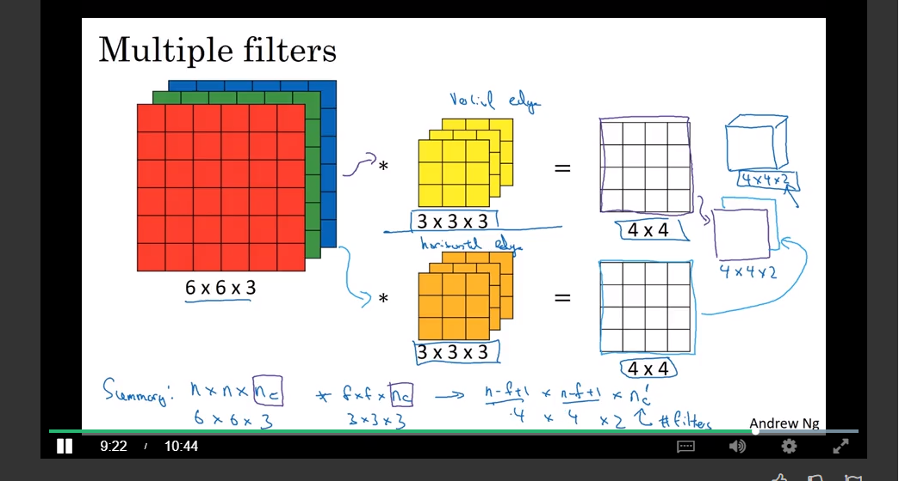

# Convolutional Neural Networks

## Week 1

### Computer Visions

### Edge Detection

Edge Detection as an application of convolution operator

### More edge detection

Different filters allow for detection of different edges (vertical vs. horizontal)

Parameters of filter might be learned

### Padding

Convolutions shrink dimensions of innputs

Some pixels are used less by convolutions than others (throws away information on the borders of the image)

__Padding__

>Surround inital matrix with zeros.
>
>__valid__ versus __same__ Paddings 
>
>__valid__: Pad x surrounds around input. Output size might be smaller thant input size, <but bigger than outpsize would be without padding.
>
>__same__: Pad so that inputsize = output size

### Strided Convolutions

Striding says how to shift the filter in the image

Technical Note: Do not mix convolutions and cross - correlation.

### Convolutions over Volume

Adding one dimension on the size of input images (RGB 64x64x3. 3 #Channels) and filter. Image and Filter number of channels must match.

Multiple Filters

### One layer of a Conv Net

Summary of Notation 

### Pooling and fully connected Layers

Max-Pooling:

### CNN Example

### Week 1 Wrap Up

